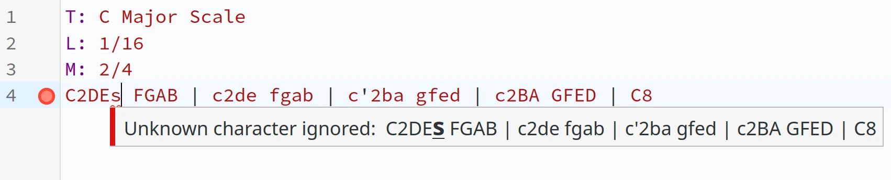

I'm excited to publish my new project, [Score In URL](https://powersnail.com/ScoreInUrl), a simple, privacy-friendly, sheet music sharing service, where the entire content is encoded in the URL itself as a query parameter. It comes with a decent editor, the score, and the audio.

## An easy way to share musical scores

The inspiration came to me when I was trying to share a little snippet of music on a forum. It was just a short exercise, but I wanted to deliver both the sheet music and the audio. Most forums don't natively support sharing any form of sheet music notation, apart from just using an image. But to open up a composing program, export to an image, upload that image to Imgur, and finally share that link just for a one-line snippet, it's tedious, and it's an overkill. More importantly, an image has no sound. You'd have to jump through more hoops of exporting, converting, and uploading for audio.

I already knew abcjs has an editor in browser that can play audio, so what I did was asking them to go to [the abcjs editor](https://www.abcjs.net/abcjs-editor.html), and paste my snippet in there. It works; there's image and there's sound, but it's kinda awkward that they have to copy & paste the score into a text box, rather than opening a link with the right content already filled out.

Something came to my mind: [hashify](https://hashify.me/) is a website which encodes a Markdown document in its URL. Pretty brilliant idea.

So, I decided to build something similar for ABC Notation. It allows you to enter plain text music just like _abcjs editor_, while the whole text is encoded into the URL. All you need to do is copy the URL to your friend, and they get the source, the sheet music, and audio in a single click. It doesn't get any simpler than that.

## Static, server-less, privacy-friendly

Since there's no need to store any file, the project can be entirely server-less. All it takes is a base64 decoder and abcjs; it can all be done in the frontend. This is why I've decided to use the query parameter, so there's no need for routing. The page takes a single parameter `s`, which contains the encoded score. 

The code is [here](https://github.com/PowerSnail/ScoreInUrl). Bundled by [vite.js], everything compiles down to a pair of HTML and JS file. No backend, no cookies, no tracking, no storage. It lives entirely inside that one browser tab.

This approach of course has its own caveat: there's a significant size limit. URLs are traditionally at most 2048 characters. How many pages of sheet music you get from those 2048 characters depend on your score, but the spirit of **Score In URL** is to share short snippets of sheet music, not to be a full-fledged music editor. There are much better tools out there for composing.

Another obvious caveat is that JavaScript is a requirement. For all the NoScript folks out there, since everything is generated on-the-fly from a base64-encoded string, there's truly no way for **Score In URL** to render anything meaningful without JavaScript.

## ABC Notation and abcjs

ABC Notation is possibly the most hand-writable plain text format for composing sheet music. Most engraving software are WYSIWYG (What You See Is What You Get), requiring a graphical interface to interact with, which is fine for a composer sitting in front of their workstation, but too heavy for building a quick, shareable snippet of music. On the other hand, ABC Notation's approach is great for this application. It might be difficult to build a complex score with ABC, but for something simple of a few measures long, it does the job better than any other system. 

For instance, to write a simple C Major scale:

```
T: C Major Scale
L: 1/16
M: 2/4
C2DE FGAB | c2de fgab | c'2ba gfed | c2BA GFED | C8
```

The result looks like: 


You can visit [this link](https://powersnail.com/ScoreInUrl/?s=VDogQyBNYWpvciBTY2FsZQpMOiAxLzE2Ck06IDIvNApDMkRFIEZHQUIgfCBjMmRlIGZnYWIgfCBjJzJiYSBnZmVkIHwgYzJCQSBHRkVEIHwgQzg%3D) to see and hear the C Major scale on **Score In URL**. Or a number of other examples: [First page of Bach's Preludio](https://powersnail.com/ScoreInUrl/?s=VDogUGFydGl0YSBJSUkgLSBQcmVsdWRpbwpDOiBKLlMuIEJhY2gKUTogMS80PTEyMApNOiAzLzQKTDogMS8xNgpLOiBFbWFqCnoyIGUnZCcgZScyYjJnMmIyIHwgKGVmZWQgZTIpQjJHMkIyIHwgRUJGQiBHQkFCIEdCRkIgfApFZWRjIEJlZGMgQkFHRiAgICB8IEVCRkIgR0JBQiBHQkZCICB8IEVlZGMgQmVkYyBCQUdGIHwKRUZHQSBCY2RlIGZnYWYgICAgfCBnYmVmIGdhYmMnIGQnZSdjJ2QnICB8IGUnYmFiIGdiYWIgZ2JmYiB8CmVlJ2QnYycgYmVjJ2UgYmVhZXwgZ2JmYiBnYmFiIGdiZmIgIHwgZWUnZCdjJyBiZWMnZSBiZWFlIHwKZ2VlZWRlZWVmZWRlIHwgZWVnZWZlZ2VhZWZlIHwgZ2VlZWRlZWVmZWRlIHwKZWVnZWZlZ2VhZWZlIHwgZ2VnZSBnZWdlIGdlZ2UgfCBnZWdkIGdlZ2QgZ2VnZCB8CmdlZz1kIGdlZ2QgZ2VnZCB8IGFlYWMgYWVhYyBhZWFjIHwgYWVhQiBhZWFCIGFlYUIgfApnZWdCIGdlZ0IgZ2VnQiB8IGdlZ0EgZ2VnQSBnZWdBIHwgZmVmQSBmZWZBIGZlZkEgfApmZWZHIGZlZkcgZmVmRyB8IGVlZUcgZWVlRyBlZWVHIHwgZWVlRiBlZWVGIGVlZUYgfApkZWRGIGRlZEYgZGVkRiB8IEVGRUYgR0JFRiBHQkVGIHwgR0FHQSBCZUdBIEJlR0EgfA%3D%3D), [Air on G String](https://powersnail.com/ScoreInUrl/?s=VDogQWlyIG9uIEcgU3RyaW5nCkM6IEouUy4gQmFjaCAoYXJyLiBBdWd1c3QgV2lsaGVsbWouKQpROiAiTGVudG8iCk06IDQvNApMOiAxLzE2Cks6IENtYWoKfDogRTE2LSB8IEUyKEFGIERDQixDKSAoIXRyaWxsIUIsNy8yQSwvMikgRyw0IHwgRzgtIEcoRV9CLEEsKSAoRF5DKShHRikgfCAKRjgtIEYoREEsRywpIChDQiwpKEZFKSB8IChFNiBeRkcpIChDMkMvMkQvMkUpIChFRCkoREMpIHwgKEIsQSwpKEEsLzJCLC8yQykgKEMyQixBLCkgRyw4IDp8IAp8OiAoQiw0LUIsQy8yQiwvMkEsLzJCLC8yRywpIChHNiBfQiwyKSB8IChBLDJBMi0gQSkoR0ZFKSB7L0V9RjQtIEYvMihFLzJELzJDLzJCLEEsKSB8IF5HLEEsKEIsMi0gQixDKShEMi0gREUpRjItIEYyRTIgfAooREMpKEIsQSwpIChCLEMvMkQvMkNCLCkgQSw4IHwgKEM0LSBDRURDKSAoQTYgR15GKSB8ICh7L0V9REdHLDIpIChBLDNCLC8yQy8yKSAoQiw3LzJBLC8yKSBHLDQgfCAKQzYgKEVEKSBENiAoRkUpIHwgRTYgKEdGKSBGOCB8IEcsNC0gRyxCLERGIEZERTItIEUyKEVGLzJHLzIpIHwgCihDNC0gQ0VHX0IpIChCMiBBNCBDMikgfCAoQixEIEY0IEEsMikgKEcsMkRFLzJGLzItIEYpKEUyRCB8IEMvMkIsLzIpKEEsMkIsKSAoQiwyey9BLH1CLEMpIEM4IDp8Cg%3D%3D).

To learn more about writing ABC notation, visit their [official website](https://abcnotation.com/). There are plenty of examples and an exhaustive documentation. For quick references, this [cheat sheet](http://www.stephenmerrony.co.uk/uploads/ABCquickRefv0_6.pdf) is superb.

Thanks to [abcjs](https://www.abcjs.net/), it's super easy to embed such a system in a web page. Abcjs provides rendering, audio, and error messages which integrate nicely with CodeMirror, the text editor.

## Text Editing

The original abcjs editor is written with a simple `textarea`, where errors are shown in a separate `div`.

To provide some rudimentary code highlighting, and more importantly, ergonomic error reporting, the text area is replaced by [CodeMirror](https://codemirror.net/). 



The code highlighting is still not comprehensive at the moment. I've merely written a few tokenization rules at this point, and certainly will improve on that in the future.

## To Do

There are a few improvements on my mind. 

First, the code highlighting should be improved. I should at least tokenize all the operators.

Second, there should be a synchronized cursor between the code editor and the score. In other words, when you are editing the plain text file, you should be able to see where you are on the engravings.

Third, some UI adjustments. I'm not satisfied with the way the buttons are laid out. It doesn't feel entirely intuitive, and is certainly something that I'll need some feedback on.

## Not in the scope

I've decided against using a compression algorithm. A simple base64 encoder is available everywhere, whereas compression requires a 3rd party library, and might be subject to the specific quirks of that implementation. If the compression has a bug, it infects every URL shared from **Score In URL**. If that algorithm ever gets an update that is not backwards-compatible, all the old URLs are screwed. Furthermore, if **Score In URL** disappears, a plain base64 string is simple to use: just copy & paste into any base64 decoder. It requires no programming skill, no tool chains, no setup. On the other hand, a compressed string is much harder to decode, especially if the user has no convenient way of installing the exact version of the compression algorithm I used.

Despite the existence of a "Print" button, printing likely won't be perfect, especially if you have more than one page of scores. Again, the project is meant for sharing snippets of music, not for typesetting a multipage score. The whole thing is rendered on to a single image, and as long as that image looks alright in the browser, that's all it matters to me.

