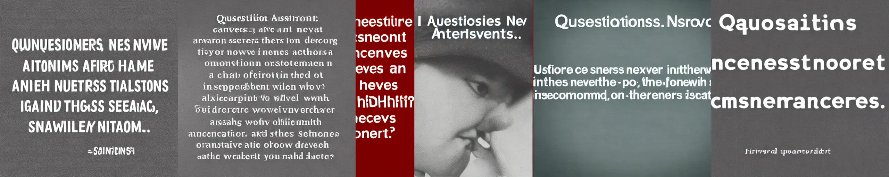
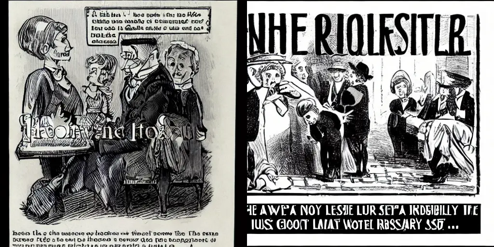

Standing opposed to OpenAI's DALL-E and Midjourney, is the open sourced model Stable Diffusion[^rombach2021highresolution]. Some of the images it painted are genuinely impressive, coherent, and free of artifacts (at least at first glance). But those are almost always the result of prompt engineering: an Edisonian process of random search through the infinite linguistic space. Or in other words, people trying different words until they get a desirable result.

For instance, there's a collection of "magic words" that improves the quality of the model's output: "4k", "detailed", etc.[^StableDiffusionPrompt] The model associates these key words with the high quality images in its training set, because that's how people label their own work, and thus tries to be close to those images.  

What happens if you don't give it a particularly graphic sentence? How does it deal with the abstract, the metaphysical, and the poetic?

## Literatures, Quotes, and Illustrations

It gives you the quote right back:

<figure>

 
<figcaption>

Questions are never indiscreet; answers sometimes are.  
--Oscar Wilde[^wildeIdealHusband2001]
</figcaption>
</figure>

......Not quite verbatim, but close enough. Similar to how "4k" nudges the model towards higher quality, if you sound like Brainy Quotes, it will paint like Brainy Quotes for you. 

Sometimes, it will go a different route, and illustrate like a book of classics:

<figure>

<figcaption>

If the lower classes don't set us a good example what on earth is the use of them? They seem, as a class, to have absolutely no sense of moral responsibility.  
--Oscar Wilde[^wildeImportanceBeingEarnest2017]
</figcaption>
</figure>

Now, this is just a silly experimentation. The model is trained on descriptions of images. It's not surprising that it wouldn't do well on metaphysical epigrams depicting no concrete objects. In fact, if you give me drawing prompt "Questions are never indiscreet; answers sometimes are", I'd probably ask you clarify just what the hell you want me to draw. 

## Where is the cicada?

<figure>

 
<figcaption>

Waxwings are berry-pecking / a cicada sings.  
--Nabokov, _Pale Fire_[^nabokovPaleFireIntroduction1992]
</figcaption>
</figure>

Another limitation I found is that Stable Diffusion sometimes ignores parts of the prompt. This is quite interesting because it obviously is capable of juxtaposing unrelated elements together, as demonstrated by the famous example of an astronaut riding a horse, in its [repository](https://github.com/CompVis/stable-diffusion). 

A beautiful line of poetry, "Waxwings are berry-pecking / a cicada sings", is not as abstract as the previous section. It depicts two subjects, a bird and a bug, and yet Stable Diffusion absolutely refuses to recognize the existence of the latter.

Could it be the position of the two words in the sentence? Let's try reversing it:

<figure>

<figcaption>

A cicada sings / Waxwings are berry-pecking.
</figcaption></figure>

Nope. Only the bird itself. Beautifully drawn, but missing its companion.

Maybe it's the realistic style which it's going for? Let's try adding some stylistic modifiers to the prompt:

<figure>

<figcaption> 

Waxwings are berry-pecking / a cicada sings. Illustration.
</figcaption></figure>

<figure>

<figcaption> 

Waxwings are berry-pecking / a cicada sings. Oil painting.
</figcaption></figure>

<figure>

<figcaption> 

Waxwings are berry-pecking / a cicada sings. Photo.
</figcaption></figure>

Still, the cicada is nowhere to be found. And if you look carefully, you'll notice that even "berry" isn't always there. The model concentrates on "waxwings", and that's the only thing it seems to _care_ about, if you'll excuse the inaccurately personified verb. Perhaps the model has a bias in its training set, some objects being more likely to appear than others, and thus carrying a heavier weight. An image with waxwings, berries, and a cicada is less likely than an image with just a waxwing, even given a prompt that includes all three elements. Is this a fundamental limitation on the model, or is it a deficiency in the training data?

## Last word

Stable Diffusion, like many other machine learning models dabbling in art, astonishes the programmer part of my brain. It's utterly ridiculous that we can prompt the program to generate coherent images, without hard-coding any rule about what it means for an image to be coherent. We give zero _a priori_ to the model on what constitutes a photo or an oil painting, or the anatomy of waxwings, or the color of trees and leaves, and yet, it does show a level of understanding of all those concepts. Put aside the thorny question of "how do you define 'understand'?", if we merely judge the program by its performance, it is capable of generating images where a human would recognize the objects, styles, lighting conditions, etc. to be the same as what the prompt describes. And again, without codifying such objects or styles by a human.

But at the same time, the other parts of my brain still smirks a bit at the results. When you jump even slightly out of the box, Stable Diffusion starts to show its limits. And even within the box, it takes a lot of word tweaking and cherry-picking to get some useful images out of the model. A lot of hobbyists left the model to run overnight on a long list of prompts. In other areas, the music generated by machine learnings are still quite bad, and seems to go from nowhere to nowhere, if we judge the music entirely on its own merit. The same goes for text generation.

It is quite disquieting to see just how close we are to computer programs surpassing human in the field of creative arts, and perhaps even programming itself. We are not there yet, but I'm willing to bet that it's going to happen within the lifetime of my generation. Where would that leave us? To become the Olympians of the machines and reap the fruit of their labor? Or to compete with the machines, and eventually---inevitably---become obsolete? Will the society become more equal as the rising productivity and efficiency alleviate scarcity, or will the divide deepen between the wealthy and powerful, and the underprivileged?

> Anybody that competes with slaves becomes a slave
>
> --Vonnegut, _Player Piano_[^vonnegutPlayerPiano1999]

<figure>

<figcaption>

Generated by Stable Diffusion: A robot playing the piano, 4k, detailed, by Studio Ghibli
</figcaption></figure>

[^nabokovPaleFireIntroduction1992]: Nabokov, V. (1992). *Pale Fire: Introduction by Richard Rorty*. Knopf Doubleday Publishing Group.

[^rombach2021highresolution]: Rombach, R., Blattmann, A., Lorenz, D., Esser, P., & Ommer, B. (2021). *High-resolution image synthesis with latent diffusion models*.

[^StableDiffusionPrompt]: *Stable Diffusion Prompt Book—OpenArt*. (n.d.). OpenArt. Retrieved November 10, 2022, from [https://openart.ai/](https://openart.ai/)

[^vonnegutPlayerPiano1999]: Vonnegut, K. (1999). *Player Piano*. Random House Publishing Group.

[^wildeIdealHusband2001]: Wilde, O. (2001). *An Ideal Husband*. Courier Corporation.

[^wildeImportanceBeingEarnest2017]: Wilde, O. (2017). *The Importance of Being Earnest & Other Plays*. Pan Macmillan.