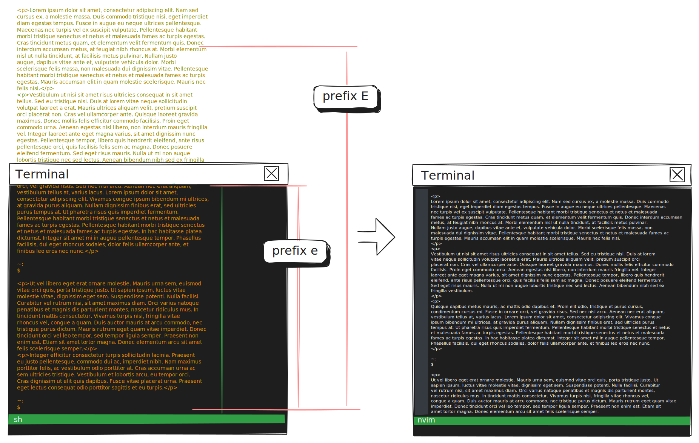

**TLDR**: I put the following lines into my `.tmux.conf`:

```sh
# Edit current pane in neovim
bind e run "tmux capture-pane -S 0 -p -J > /tmp/tmux-edit && tmux new-window 'nvim /tmp/tmux-edit'"
bind E run "tmux capture-pane -S - -p -J > /tmp/tmux-edit && tmux new-window 'nvim /tmp/tmux-edit'"
```

## Navigation in Neovim

`tmux` and `neovim` are essential parts of my work flow, both of which are very good at being worked on with keyboard only.

Having recently invested into `neovim` plugins like [mini.jump2d](https://github.com/echasnovski/mini.nvim/blob/main/readmes/mini-jump2d.md) and [leap.nvim](https://github.com/ggandor/leap.nvim), I find myself increasingly spoiled. These two plugins, in slightly different ways, provide the capability of moving the cursor to where you are looking at, by identifying that location with a few key strokes. The premise is that if you have somewhere you want the cursor to go, it's likely you are already staring at it, so let's show some labels all around the buffer, and you can type the label right at the destination. _leap.nvim_ does it by having you type a 2-gram, while _mini.jump2d_ finds places like word boundaries, etc.

The mechanism are better demonstrated by their own docs, but essentially for me, it's like semi-auto eyeball tracking. This kind of navigation might not give you the path of fewest number of keystrokes, but it requires the least amount cognitive load in my experience (compared to reading relative line numbers for example), because it incurs very little context switching in my mind.

## Tweaking tmux

Newly spoiled, I find the experience of moving around in `tmux`'s copy mode increasingly lacking. I habitually type `s` (my binding to `leap.nvim`) when I'm in `tmux`, while staring into the target position waiting for my key stroke hints to show up, as if waving a credit card at tip jar. I want to replicate the leaps and jumps everywhere in the terminal, especially in `tmux`. (In fact, I want my entire GUI screen to do this as well: show me all clickable/focusable areas, with a label that I can navigate to; but that's a different story.)

Instead of trying to replicate the capability in `tmux`---which probably is not only difficult, but also unlikely to provide a 100% identical experience---I looked for a shortcut, like any respectable lazy engineer would do: I'll just open the current pane in `neovim`. This way, I don't have to re-invent the wheel and only have to configure my navigation once in one place.

In the end, all that needs to be done is a two-line configuration in `.tmux.conf`:

```sh
# Edit current pane in neovim
bind e run "tmux capture-pane -S 0 -p -J > /tmp/tmux-edit && tmux new-window 'nvim /tmp/tmux-edit'"
bind E run "tmux capture-pane -S - -p -J > /tmp/tmux-edit && tmux new-window 'nvim /tmp/tmux-edit'"
```

Some explanations [@marriottTmux1LinuxManual2024]:

-   `tmux capture-pane` gets the content of the current pane;
-   `-J` unwraps line breaks created by `tmux`, this makes stuff like URL, string literals more greppable and more copyable.
-   `-p` pipes it to `stdout`, which gets piped into `/tmp/tmux-edit`;
-   `tmux new-window 'nvim /tmp/tmux-edit'` runs neovim in a new tmux window.
-   `-S` specifies at which line the capture starts, and 0 is the topmost visible line, while `-` is the topmost line in the pane's history. With this, I created two variants of the command: lowercase <kbd>e</kbd> is bound to capturing the currently visible lines, which I use the most; and capital <kbd>E</kbd> is bound to capturing the entire history.




## Room for Improvements

One, this is not going to work if I try to edit two panes at the same time. A more elegant solution is to create a uniquely-named temp file in place of `/tmp/tmux-edit`, but that takes away the simplicity of the solution, as we'll have to deal with quoting & escaping of quotation marks inside a shell command, inside an argument to `tmux new-window` inside a shell command inside `tmux` configuration file, while making sure that the filename variable is expanding at the right stage. It is not going to be fun. I'll settle with no concurrency for now.

Two, `neovim` doesn't necessarily do too well with very, very long lines, and it is entirely possible that somewhere in the pane history, I `cat` some minified file by accident.

