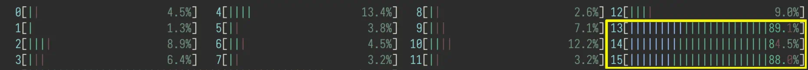
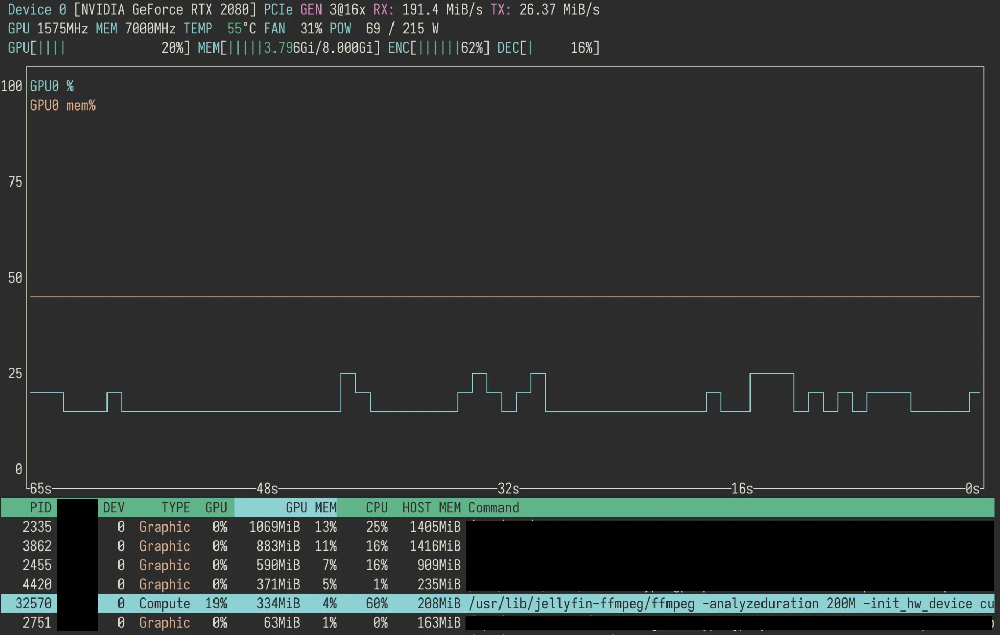

## What is it all about?

Here is what I'm trying to do: I want to watch TV at home. On my hard drive, is a collection of videos, and I'd like to stream them from my PC to mobile devices. The PC runs openSUSE, has an NVIDIA card, and Jellyfin---a sort of self-hosted Netflix---is my choice for managing the multimedia files and the streaming.

## Why am I Running Jellyfin in Docker

You can run Jellyfin just by itself, un-containerized, and tell it to use the dependencies that are installed by your OS's package manager. It would be more space-efficient. You would need one less moving parts (Docker).

I run Jellyfin in a Docker container, mainly for the bundled FFmpeg. Jellyfin uses FFmpeg as the underlying tool that does all the heavy-lifting with regard to processing the videos. The problem is that FFmpeg is one of those programs which come with a huge number of compiling options, some of which are turned off by default, some can't be enabled in certain distributions due to licensing issues. These can't be tweaked at runtime. I can compile FFmpeg myself, but first, that defeats the purpose of saving space, and it would be a pain to keep it up to date and resolve compatibility issues between it, the OS, and Jellyfin. Using the official docker image will likely be less of a headache.

Another reason, applicable to software that deals with the file system, is that there's less of a chance that a bug could affect unrelated files, since Docker only gives it access to specified directories. If Jellyfin messes up, at most my media folder gets obliterated, which I have a backup for, and which is easily rectified when the rest of the file system is left untouched.

At last, it's easy to put constraints on how many cores Jellyfin can use. My machine has 16 cores, and really, to enable the transcoding of videos for one or two users, no more than 2 or 3 cores are necessary. However, for some reason, when I ran it bare metal, I was never able to enact that restriction, whether through Jellyfin's settings, or some other system tools. Docker, on the other hand, can expose a selected set of cores, which as far as all the transcoding processes know, are all the cores existing.

## Installing Dependencies

To install Docker and Docker Compose,

```bash
sudo zypper in docker docker-compose
sudo systemctl enable --now docker
```

To install graphics card drivers (this configuration works only with Nvidia's proprietary drivers), openSUSE has an [official guide](https://en.opensuse.org/SDB:NVIDIA_drivers), and I use what they call "the easy way", which means adding a repository that is co-managed by NVIDIA and openSUSE, and installing the driver via `zypper`.

```bash
sudo zypper addrepo --refresh "https://download.nvidia.com/opensuse/tumbleweed" NVIDIA
sudo zypper in nvidia-video-G06 nvidia-gl-G06
```

**Do read the guide carefully**, though, as the instructions differ for different card models. `06` is what works for my card, something else might for yours.

With the proper drivers installed, we also need *NVIDIA's Container Toolkit* to make it work with Docker. The slight problem is that NVIDIA doesn't package this toolkit for Tumbleweed, only Leap, so I'm taking some risks here to use a library for a not-exactly-compatible distribution. Well, if it works, it works. 

Using the [guide for Leap 15](https://docs.nvidia.com/datacenter/cloud-native/container-toolkit/install-guide.html#installing-on-suse-15):

```bash
sudo zypper ar "https://nvidia.github.io/libnvidia-container/opensuse-leap15.1/libnvidia-container.repo"
sudo zypper ref
sudo zypper in nvidia-container-toolkit
sudo nvidia-ctk runtime configure --runtime=docker
```

And I restart the PC at this point, just to make sure that all the enabled services are running. 

## Composing Docker for Jellyfin

Here's what the official Jellyfin guide says:

```bash
docker pull jellyfin/jellyfin:latest
mkdir -p /srv/jellyfin/{config,cache}
docker run -d -v /srv/jellyfin/config:/config \
    -v /srv/jellyfin/cache:/cache \
    -v /media:/media \
    --net=host \
    jellyfin/jellyfin:latest
```

From the host OS's perspective, the configuration files are stored in `/srv/jellyfin/config`, the caches in `/srv/jellyfin/cache`, the media files in a hypothetical `/media` directory. Just use wherever your media is (`-v /path/to/media:/media`). Inside Jellyfin's configuration, all the media files are relative to `/media`.

We have more parameters to pass in and to better manage these options, a compose file is simpler and cleaner in my opinion than a shell script:

```yaml
# docker-compose.yaml

version: '3.3'
services:
  jellyfin:
    volumes:
      - '/srv/jellyfin/config:/config'
      - '/srv/jellyfin/cache:/cache'
      - '/path/to/media:/media'
    network_mode: host
    image: 'jellyfin/jellyfin:latest'
    cpuset: "13-15"
    environment:
      - NVIDIA_DRIVER_CAPABILITIES=all
      - NVIDIA_VISIBLE_DEVICES=all
    deploy:
      resources:
        reservations:
          devices:
            - driver: nvidia
              count: 1
              capabilities: [gpu]
```

To put a restriction on the cores used by Jellyfin, the option `cpuset` is used, and I set it to `13-15` which exposes the last three cores, sufficient for my personally use.

To enable hardware acceleration, we give the container permission to use the cards with environment variables (these are for the NVIDIA Container Toolkit). `NVIDIA_DRIVER_CAPABILITIES=all` grants permission to all capabilities. `NVIDIA_VISIBLE_DEVICES=all` grants permission to all cards. You can fine-tune which card and what capabilities Jellyfin has access to, by following NVIDIA's [guide](https://docs.nvidia.com/datacenter/cloud-native/container-toolkit/user-guide.html). 

The rest of the options is the Docker Compose's way of giving access of the GPU to the container: <https://docs.docker.com/compose/compose-file/deploy/>.

## Configuring NVENC and NVDEC in Jellyfin

The model of my graphics card is RTX 2080, which can be checked by running:

```bash
nvidia-smi -L  # GPU 0: NVIDIA GeForce RTX 2080
```

The encoding and decoding capabilities of the card can be checked on NVIDIA's website: <https://developer.nvidia.com/video-encode-and-decode-gpu-support-matrix-new>. For my 2080, I've gotten a good list of decode-able codecs (MPEG-1, MPEG-2, VC-1, VP8, VP9, H.264, H.265), and H.264 and H.265 for encoding, which are more than enough. The only thing missing is AV1 support, which is at the moment not that widely used, but whose popularity is on the rise.

In Jellyfin, in the section `Dashboad>Playback>Transcoding`, set "Hardware acceleration" to "Nvidia NVENC", check the boxes for the supported codecs listed above, and tick the options "Enable enhanced NVDEC decoder", and "Enable hardware encoding".  

It's important to know which codec to enable, because Jellyfin blindly trusts the configuration, and won't test whether the GPU is actually capable of doing a specific transcoding. If an option were to be mis-selected, there wouldn't be a fallback, and the video would fail to load.

## How well does it work?

Here's the CPU usage---specifically the usage of core 13, 14, and 15---when playing a H.265 video, **without** hardware acceleration:

<figure>

 
<figcaption>

CPU usage without hardware acceleration
</figcaption>
</figure>

After enabling hardware acceleration, when playing the same video, the core usages drop to below 40%, and you can see from the `nvtop` (a tool which displays GPU usage), that a FFmpeg process is utilizing the GPU. Now, obviously this data is just a snapshot and is noisy, given all the other processes running on the machine. Although I don't have a clean, isolated, long-lasting series of data showing the history of CPU usage, it is my observation that the drop is both significant and consistent through time. For one, it no longer causes FPS to fluctuate, when a video starts to play while I'm in the middle of a game.

<figure>

 
<figcaption>

CPU usage with hardware acceleration
</figcaption>
</figure>

<figure>


<figcaption>

GPU usage during transcoding
</figcaption>
</figure>

And of course, hardware acceleration isn't just making the GPU busier and the CPU idler; another benefit is that, titularly, the video is transcoded faster. This isn't noticeable in the middle of playing a video, because Jellyfin would, like any competent streaming software, transcode the next chunk when you are still watching the previous one. 

It shines when **starting** a video, and more importantly, when I'm **jumping around** the progress bar. What used to be a few seconds of spinning circles, is now only a slight punctuation. The improvement on snappiness simply by moving the work from CPU to GPU is, frankly speaking, astonishing.

## References

<div class="csl-entry">Docker Inc. (2023, March 10). <i>Compose file deploy reference</i>. Docker Documentation. <a href="https://docs.docker.com/compose/compose-file/deploy/">https://docs.docker.com/compose/compose-file/deploy/</a></div>
  <span class="Z3988" title="url_ver=Z39.88-2004&amp;ctx_ver=Z39.88-2004&amp;rfr_id=info%3Asid%2Fzotero.org%3A2&amp;rft_val_fmt=info%3Aofi%2Ffmt%3Akev%3Amtx%3Adc&amp;rft.type=webpage&amp;rft.title=Compose%20file%20deploy%20reference&amp;rft.description=Compose%20file%20deploy%20reference&amp;rft.identifier=https%3A%2F%2Fdocs.docker.com%2Fcompose%2Fcompose-file%2Fdeploy%2F&amp;rft.au=undefined&amp;rft.date=2023-03-10&amp;rft.language=en"></span>
  <div class="csl-entry">Jellyfin Community. (n.d.). <i>Downloads | Jellyfin</i>. Retrieved March 10, 2023, from <a href="https://jellyfin.org/downloads/docker/">https://jellyfin.org/downloads/docker/</a></div>
  <span class="Z3988" title="url_ver=Z39.88-2004&amp;ctx_ver=Z39.88-2004&amp;rfr_id=info%3Asid%2Fzotero.org%3A2&amp;rft_val_fmt=info%3Aofi%2Ffmt%3Akev%3Amtx%3Adc&amp;rft.type=webpage&amp;rft.title=Downloads%20%7C%20Jellyfin&amp;rft.identifier=https%3A%2F%2Fjellyfin.org%2Fdownloads%2Fdocker%2F&amp;rft.au=undefined&amp;rft.language=en"></span>
  <div class="csl-entry">NVIDIA Corporation. (2020, September 8). <i>Video Encode and Decode GPU Support Matrix</i>. NVIDIA Developer. <a href="https://developer.nvidia.com/video-encode-and-decode-gpu-support-matrix-new">https://developer.nvidia.com/video-encode-and-decode-gpu-support-matrix-new</a></div>
  <span class="Z3988" title="url_ver=Z39.88-2004&amp;ctx_ver=Z39.88-2004&amp;rfr_id=info%3Asid%2Fzotero.org%3A2&amp;rft_val_fmt=info%3Aofi%2Ffmt%3Akev%3Amtx%3Adc&amp;rft.type=webpage&amp;rft.title=Video%20Encode%20and%20Decode%20GPU%20Support%20Matrix&amp;rft.description=Find%20the%20related%20video%20encoding%20and%20decoding%20support%20for%20all%20NVIDIA%20GPU%20products.&amp;rft.identifier=https%3A%2F%2Fdeveloper.nvidia.com%2Fvideo-encode-and-decode-gpu-support-matrix-new&amp;rft.au=undefined&amp;rft.date=2020-09-08&amp;rft.language=en-US"></span>
  <div class="csl-entry">NVIDIA Corporation. (2023a, March 8). <i>Installation Guide—NVIDIA Cloud Native Technologies&nbsp; documentation</i>. <a href="https://docs.nvidia.com/datacenter/cloud-native/container-toolkit/install-guide.html">https://docs.nvidia.com/datacenter/cloud-native/container-toolkit/install-guide.html</a></div>
  <span class="Z3988" title="url_ver=Z39.88-2004&amp;ctx_ver=Z39.88-2004&amp;rfr_id=info%3Asid%2Fzotero.org%3A2&amp;rft_val_fmt=info%3Aofi%2Ffmt%3Akev%3Amtx%3Adc&amp;rft.type=webpage&amp;rft.title=Installation%20Guide%20%E2%80%94%20NVIDIA%20Cloud%20Native%20Technologies%20%20documentation&amp;rft.identifier=https%3A%2F%2Fdocs.nvidia.com%2Fdatacenter%2Fcloud-native%2Fcontainer-toolkit%2Finstall-guide.html&amp;rft.au=undefined&amp;rft.date=2023-03-08"></span>
  <div class="csl-entry">NVIDIA Corporation. (2023b, March 8). <i>User Guide—NVIDIA Cloud Native Technologies documentation</i>. <a href="https://docs.nvidia.com/datacenter/cloud-native/container-toolkit/user-guide.html">https://docs.nvidia.com/datacenter/cloud-native/container-toolkit/user-guide.html</a></div>
  <span class="Z3988" title="url_ver=Z39.88-2004&amp;ctx_ver=Z39.88-2004&amp;rfr_id=info%3Asid%2Fzotero.org%3A2&amp;rft_val_fmt=info%3Aofi%2Ffmt%3Akev%3Amtx%3Adc&amp;rft.type=webpage&amp;rft.title=User%20Guide%20%E2%80%94%20NVIDIA%20Cloud%20Native%20Technologies%20documentation&amp;rft.identifier=https%3A%2F%2Fdocs.nvidia.com%2Fdatacenter%2Fcloud-native%2Fcontainer-toolkit%2Fuser-guide.html&amp;rft.au=undefined&amp;rft.date=2023-03-08"></span>
  <div class="csl-entry">openSUSE contributors &amp; others. (2020, July 22). <i>SDB:NVIDIA drivers—OpenSUSE Wiki</i>. <a href="https://en.opensuse.org/SDB:NVIDIA_drivers">https://en.opensuse.org/SDB:NVIDIA_drivers</a></div>
  <span class="Z3988" title="url_ver=Z39.88-2004&amp;ctx_ver=Z39.88-2004&amp;rfr_id=info%3Asid%2Fzotero.org%3A2&amp;rft_val_fmt=info%3Aofi%2Ffmt%3Akev%3Amtx%3Adc&amp;rft.type=webpage&amp;rft.title=SDB%3ANVIDIA%20drivers%20-%20openSUSE%20Wiki&amp;rft.identifier=https%3A%2F%2Fen.opensuse.org%2FSDB%3ANVIDIA_drivers&amp;rft.au=undefined&amp;rft.date=2020-07-22"></span>