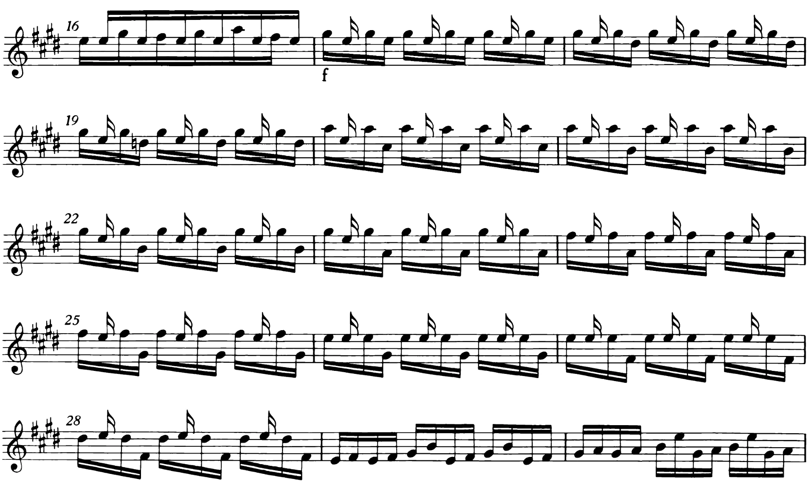

*Preludio* (*Prelude* in some version) is one of Bach's best violin pieces. From measure 17 to 28, a bariolage among three strings brings us a sublime polyphonic experience, with only single notes played detaché. The focus is usually on the bowing, but the left hand is not without challenge either, especially at speed.

From measure 20 to 28, the left hand descends one position every two measures. The most straightforward way is to shift at the beginning of measure 21, 23, 25, 27, and 28, using the third finger on A string, the first finger always pressing the lower note on D string, as shown below:

There are two ways to hide this shift. The first is to squeeze your 3rd finger inward without shifting when the bow is still on the D string, and then to complete the shift by moving the 1st finger while playing the other three notes. But given how cramped the notes are on higher positions, that squeeze might be a bit awkward.

The second way is to delay the shift and hide it using the open E. In measure 20, the 1st finger is on C♯, the 2nd finger on A. If we don't shift, we'll begin measure 21 with 2nd finger on A, too. Then, when the bow is on the open E, shift the entire hand down a position, and substitute the 3rd finger on A, the 1st finger naturally falling on B. If you can shift within the duration of that E, there will be no audible shift. And this way, there is no squeezing, or awkward hand frame. Like this:

Then, in the measure 22, no shift is needed. In measure 23, begin with 2nd finger on G♯, shift during the open string E, and end with 3rd finger on G♯. So on, and so on.

There are many opportunities in this piece to use the sneaky shift. Measure 67 begins a bariolage that exactly mirrors this sections on the lower strings, so does the technique. The two-string bariolages, like the ones from measure 13~16, also have a few places for sneaky shift.

---

If you study the fingering of great violinists, you'll see a lot of creativity in how they achieve the balance between techniques, musicality, and ergonomics. Szeryng's fingering of solo Bach is famous for its clever problem-solving skills, using tiny slides to avoid awkward string crossing, using stretches to avoid slides, etc.

At the end of the day, it all depends on what kind of phrasing and tone you have in mind. A sneaky shift is great for that clean crisp sound, and an over-slide might be just what you need in a lyrical moment. Fingering is personal, because style is personal. 

## Reference

Bach, Johann Sebastian. *Drei Sonaten Und Drei Partiten Fur Violino Solo*. Bärenreiter Verlag, 1720, [6 Violin Sonatas and Partitas, BWV 1001-1006 (Bach, Johann Sebastian) - IMSLP: Free Sheet Music PDF Download](https://imslp.org/wiki/6_Violin_Sonatas_and_Partitas,_BWV_1001-1006_(Bach,_Johann_Sebastian)).