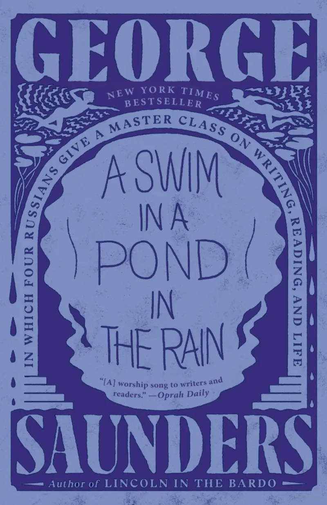

## Summary

The book contains analysis of seven short stories written by Russian authors. Saunders looks at the stories from a pragmatic point of view, showing us why those stories engage us, how the writers did it, and at times, when they display their own shortcomings. There's no "-ism" in this book, or complex literary theories. Instead, he talks about readers' expectations, raising and answering questions, the cart of _Things I Couldn't Help Noticing_(TICHN), and escalations.

The seven stories in the book are:

- **In the Cart** by Anton Chekhov
- **The Singers** by Ivan Turgenev
- **The Darling** by Anton Chekhov
- **Master and Man** by Leo Tolstoy
- **The Nose** by Nikolai Gogol
- **Gooseberries** by Anton Chekhov
- **Alyosha the Pot** by Leo Tolstoy

