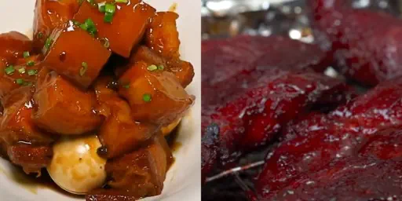
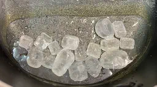
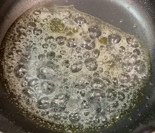
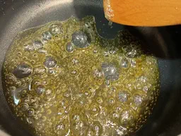
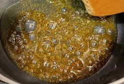
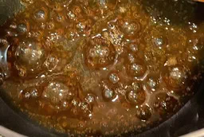
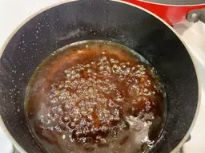
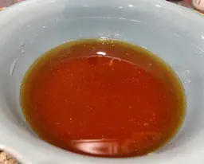
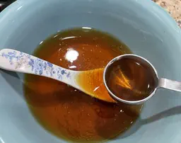
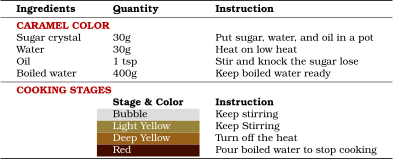

## 糖色: Chinese Caramel Color

The iconic Chinese cuisine Red Braised Pork Belly has an appetizing, deep, brick-red color. This comes from 糖色(tang se): caramel color. Sugar crystals are heated to a deep red color, and diluted with water. The result is a translucent shimmery red solution, more natural and appetizing than the pinkish red of 红曲粉 (red yeast rice powder), which is found on some Cantonese Char Siu.

<figure>
    
    <figcaption>
        Compare the color of red braised pork belly vs. Char Siu
    </figcaption>
</figure>

We can roughly break the process down to four stages: melting, bubbling, turning yellow, and turning red.

<figure>
    
    <figcaption>Melting sugar</figcaption>
</figure>

To melt the sugar, turn on low heat and toss **30 grams of sugar crystals** in the pot, with **1 teaspoon of oil**, and **30 grams of water**. Keep stirring, and knocking on the crystals with the back of your spoon (or spatula) to break them apart.

You can use just the oil, or just the water, too; I find oil & water mixture to be easier to work with. Water makes it easier to melt the sugar in the initial stage, and oil helps to buffer the heat when the sugar starts caramelizing.

<figure>
    
    <figcaption>Bubbling</figcaption>
</figure>

After the sugar melt, the syrup will start to bubble. Keep stirring.

<figure>
    
    <figcaption>#97843A Light Yellow</figcaption>
</figure>

When the syrup turns #97843A (light yellow), caramelization has begun. Continue to stir, and be extra careful now, because the syrup will change color very rapidly.

<figure>
    
    <figcaption>#996118 Deep Yellow</figcaption>
</figure>

When the syrup turns #996118 (dark yellow), turn off the heat. The residual heat is enough to cook the caramel.

<figure>
    
    <figcaption># 420C00 Brick Red</figcaption>
</figure>

When the syrup turns #420C00 (brick-red), pour 400 grams of boiling water into the pot to stop the cooking. Be careful: some violent splattering is to be expected. Give the solution a few more rounds of stirring to ensure that it is even.

<figure>
    
    <figcaption>Pour water in to the pot</figcaption>
</figure>

## Finalizing

<figure>
    
    <figcaption>Final Product</figcaption>
</figure>

Here's our finished Chinese caramel color in a bowl. To use it, scoop a generous amount into your braised dish at the beginning of cooking.

<figure>
    
    <figcaption>Caramel Color vs. Earl Grey</figcaption>
</figure>

The caramel color should be roughly the same color as a cup of black tea. That's Earl Grey in the metal spoon for your reference.

## Summary

